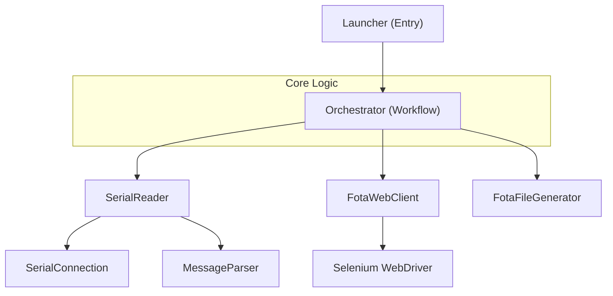

# FOTA Automation System

A comprehensive Java-based automation suite designed for Firmware Over-The-Air (FOTA) updates on Telematics Control Units (TCU).

## 🚀 Overview

The FOTA Automation System streamlines the process of updating firmware on embedded devices. It coordinates serial communication with the hardware, web automation for the FOTA management platform, and intelligent file orchestration to manage update batches.

## ✨ Key Features

-   **Serial Communication**: Real-time monitoring of device boot sequences and internal states via serial ports.
-   **Web Automation**: Selenium-based interaction with the centralized FOTA dashboard for batch uploads and status tracking.
-   **File Orchestration**: Dynamic generation of batch configuration files (CSV) with smart versioning logic.
-   **Real-time Monitoring**: Tracks download progress and update status directly from the device console.
-   **Audit Logging**: Comprehensive recording of update history, including success/failure summaries.

## 🛠 Technology Stack

-   **Language**: Java 21
-   **Build Tool**: Maven
-   **Libraries**:
    -   `jSerialComm`: Serial port communication.
    -   `Selenium`: Web UI automation.
    -   `Apache Commons CSV`: Parsing and generating CSV files.
    -   `Jackson`: JSON processing.
    -   `Log4j 2`: Logging framework.
    -   `JUnit`: Testing framework.

## 📁 Project Structure

| Component | Description |
| :--- | :--- |
| `Launcher.java` | Application entry point; initializes environment and config. |
| `Orchestrator.java` | Workflow manager; coordinates serial and web activities. |
| `SerialReader.java` | Manages serial port data aggregation and parsing. |
| `FotaWebClient.java` | Handles Selenium-based web interactions with the FOTA portal. |
| `FotaFileGenerator.java` | Generates batch upload CSV files with incremented versions. |
| `MessageParser.java` | Extracts information from raw serial strings using regex. |

## ⚙️ Getting Started

### Prerequisites

-   **JDK 21**: Ensure Java 21 is installed and configured in your environment.
-   **Maven**: Used for building and dependency management.
-   **Hardware**: TCU device connected via serial/USB.

### Configuration

Modify the `config.properties` file in the project root to set your environment parameters (COM ports, web URLs, credentials, etc.).

### Build & Run

To build the project and create a fat JAR:
```bash
mvn package
```

To run the application:
```bash
mvn exec:java
```

## 🔄 Workflow



## 📄 License

[Insert License Information Here]
