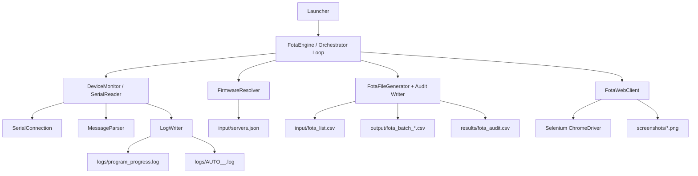

# FOTA Automation System

Java automation for continuous FOTA execution on ATCU devices using serial telemetry + web portal batch operations.

## What This Project Does

The application continuously:
1. reads device serial output,
2. detects current firmware (`aeplFwVer`) and login packet details,
3. resolves the next firmware from `input/servers.json`,
4. generates a batch CSV,
5. creates and runs a FOTA batch in the web portal,
6. verifies completion using both serial progress and portal batch status,
7. writes audit results to `results/fota_audit.csv`.

## Advantages of Current Approach

- `Dual verification`:
  Serial-side progress/version checks and web-side batch completion both must pass before marking success.
- `Resilient parsing`:
  `MessageParser` supports multiple line formats (key-value, `aeplFwVer`, and `55AA` login packet), plus ANSI cleanup.
- `Data-driven upgrade logic`:
  Upgrade sequencing is externalized in `input/servers.json`; no code change needed to adjust state/version mappings.
- `Safe cycle behavior`:
  If required data is missing (e.g., no `aeplFwVer`, no valid UIN), it retries instead of forcing bad actions.
- `Operational traceability`:
  Detailed logs, IMEI-specific serial logs, screenshots, generated batch files, and audit CSV records.
- `Separation of concerns`:
  Serial transport/parsing, version resolution, CSV generation, and web automation are separated into focused classes.

## Simpler Version (Same Functionality)

If you want the same result with less complexity, use this structure:

### Target Simplified Modules

- `Main`
  Load config, create services, run loop.
- `DeviceMonitor`
  Wrap serial port read + parse. Expose one `DeviceSnapshot` object (`state`, `uin`, `imei`, `currentVersion`, `downloadProgress`).
- `VersionService`
  Read `servers.json`, return next version.
- `BatchService`
  Build CSV (either from login packet or fallback source CSV) and append audit rows.
- `PortalService`
  Login, upload batch, start batch, poll status.
- `FotaEngine`
  Single orchestration loop coordinating the five services.

### Simplification Rules

- Replace many mutable fields in `SerialReader` with one immutable `DeviceSnapshot` updated atomically.
- Keep one parser entry point that returns a typed event (`VERSION_FOUND`, `LOGIN_PACKET`, `PROGRESS`, `NONE`).
- Keep one retry policy object (timeouts, polling intervals, max attempts) instead of hardcoded sleeps across classes.
- Keep one structured result object per cycle (`CycleResult`) for logging and audit.

### Migration Plan

1. Keep `FirmwareResolver`, `MessageParser`, and `FotaWebClient` behavior as-is initially.
2. Introduce `FotaEngine` + `DeviceSnapshot` and move loop logic from `Orchestrator` into it.
3. Move CSV/audit calls behind `BatchService` to isolate file operations.
4. Collapse extra state in `SerialReader` and expose only snapshot + events.
5. Add 3 focused tests: version resolution, parser event detection, and cycle success/failure branching.

This keeps the same functionality but makes runtime state easier to reason about and maintain.

## Updated Architecture Diagram



## Runtime Inputs and Outputs

### Inputs

- `input/servers.json`: state-wise firmware map.
- `input/fota_list.csv`: fallback device list for batch generation.
- `config.properties` (optional): overrides defaults.
- Serial device on configured COM port.

### Outputs

- `output/fota_batch_*.csv`
- `results/fota_audit.csv`
- `logs/program_progress.log`
- `logs/AUTO_<IMEI>_<timestamp>.log`
- `screenshots/*.png`

## Build and Run

```bash
mvn clean package
mvn exec:java
```

Main class: `com.aepl.atcu.Launcher`

## Notes

- Java version in `pom.xml`: 21.
- Default config fallback values are inside `Launcher` when `config.properties` is missing.
