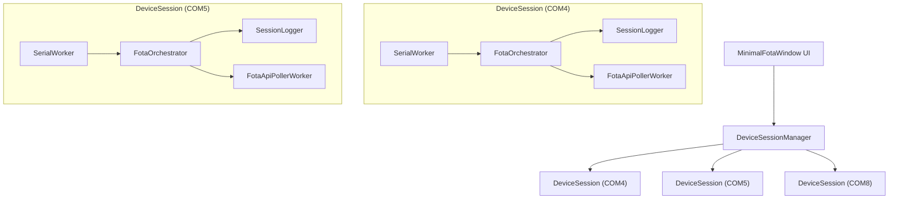

# Multi-Device Concurrent FOTA Automation Plan & Technical Specification

This document provides the complete architecture, UI design specifications, and implementation roadmap for upgrading the **Continuous FOTA Utility** from single-device serial monitoring to **Multi-Device Concurrent Automation** (running multiple COM ports simultaneously).

---

## 🎨 Multi-Device UI Target Specification


---

## 🏗️ Architectural Design

Currently, the application operates on a single serial worker (`SerialWorker`), single orchestrator (`FotaOrchestrator`), and single log terminal (`InteractiveTerminalConsole`).

To support multiple devices concurrently (e.g., 4, 8, or 16 devices connected via USB-to-Serial hubs):
1. **Isolated Device Session Workers**: Each connected COM port operates its own encapsulated `DeviceSession` containing an independent `SerialWorker`, `FotaOrchestrator`, `FotaApiPollerWorker`, and `SessionLogger`.
2. **Device Session Manager**: A central coordinator manages session lifecycles, aggregates live telemetry, and routes commands to specific COM ports.
3. **Multi-Device UI Dashboard**: A unified multi-card grid dashboard displaying live telemetry, download progress, and stage statuses for all active devices side-by-side, with dedicated console terminals.



---

## 📐 Step-by-Step UI Refactoring Strategy

### 1. Extract `DeviceCardWidget` ([ui/widgets.py](file:///d:/AEPL_AUTOMATION/FOTA_ACTIVITY/ui/widgets.py))
Modularize the existing single-device layout into a self-contained, reusable `DeviceCardWidget(QFrame)` class:

```python
class DeviceCardWidget(QFrame):
    """Self-contained status card for a single active COM port device."""
    def __init__(self, port_name: str, config, parent=None):
        super().__init__(parent)
        self.port_name = port_name
        # 1. Port Header: Port Name (e.g. "COM5"), Status Badge ("ONLINE")
        # 2. Telemetry Cards: IMEI, UIN, VIN, ICCID, State, Version (lbl_imei, lbl_uin, etc.)
        # 3. FOTA Progress Bar: 2-decimal percentage progress
        # 4. 10-Stage Mini Pipeline Strip: Badges for S1 through S10
        # 5. Serial Console Terminal: Mini InteractiveTerminalConsole
        # 6. Command Input & Action Buttons: Input bar, Send, Clear Log, Clear Info
```

### 2. Multi-Port Selection Dropdown ([ui/widgets.py](file:///d:/AEPL_AUTOMATION/FOTA_ACTIVITY/ui/widgets.py))
Upgrade the top header port dropdown `combo_ports` to a multi-select checkable dropdown `MultiPortSelectCombo`:
- Displays checkable list items: `[✓] COM4`, `[✓] COM5`, `[✓] COM8`.
- Shows total selected ports in button text: `Selected Ports: COM4, COM5, COM8 (3)`.

### 3. Responsive Multi-Device Grid Container ([ui/app.py](file:///d:/AEPL_AUTOMATION/FOTA_ACTIVITY/ui/app.py))
Replace single-device container in Tab 1 with a `QScrollArea` containing a `QGridLayout`:
- Dynamically arranges `DeviceCardWidget` instances in a 2x2 grid (or 3x2 for widescreen displays).
- As ports are selected and started, new `DeviceCardWidget` instances populate the grid smoothly.

### 4. Global Operations Header Bar ([ui/app.py](file:///d:/AEPL_AUTOMATION/FOTA_ACTIVITY/ui/app.py))
Refactor top navigation bar:
- `Target State` Dropdown
- `Multi-Port` Selector
- `▶ Start All` (Green button)
- `⏹ Stop All` (Red button)
- `🔄 Refresh Ports`
- `🌙 Theme Toggle`

---

## ⚙️ Backend Classes Specification

### 1. `DeviceSession` Container Class (`backend/session_manager.py`)
- Encapsulates:
  - `port_name`: str (e.g. `"COM5"`)
  - `serial_worker`: `SerialWorker`
  - `orchestrator`: `FotaOrchestrator`
  - `session_logger`: `SessionLogger`
- Emits unified signals:
  - `telemetry_updated(port_name, LoginPacketInfo)`
  - `progress_updated(port_name, progress_float)`
  - `stage_updated(port_name, stage_id, state_str, remark_str)`
  - `log_line_received(port_name, line_str)`

### 2. `DeviceSessionManager` (`backend/session_manager.py`)
- Maintains `self.sessions: Dict[str, DeviceSession]`.
- Methods:
  - `start_session(port_name, baudrate)`
  - `stop_session(port_name)`
  - `start_all_sessions(port_list)`
  - `stop_all_sessions()`
  - `send_command_to_port(port_name, command)`
  - `broadcast_command(command)`

### 3. Log Isolation (`backend/session_logger.py`)
- Automatically creates distinct log files per active device session:
  `logs/{IMEI}_{REL_FETCHED}_TO_{REL_UPDATE}_{PORT}.log` (e.g., `logs/861564069210428_5.2.9_TO_5.2.10_COM5.log`).

---

## 📋 Code Modification Roadmap

| Phase | Tasks | Target Files |
| :--- | :--- | :--- |
| **Phase 1: Session Management Architecture** | Create `DeviceSession` and `DeviceSessionManager` classes to manage multiple independent `SerialWorker` and `FotaOrchestrator` instances concurrently. | `backend/session_manager.py` |
| **Phase 2: Multi-Device Dashboard Cards** | Build `DeviceCardWidget` and multi-port selection dialog for parallel device monitoring. | `ui/widgets.py` |
| **Phase 3: Multi-Console & Router Integration** | Connect multi-port serial logs and commands to dedicated device console views. | `ui/app.py` |
| **Phase 4: Shared Audit & CSV Synchronization** | Ensure multi-session audit records write safely with thread-safe file locks to `fota_results.csv`. | `backend/orchestrator.py` |
| **Phase 5: PyInstaller Executable Build** | Update `build_exe.py` script to bundle the multi-device executable. | `build_exe.py` |
